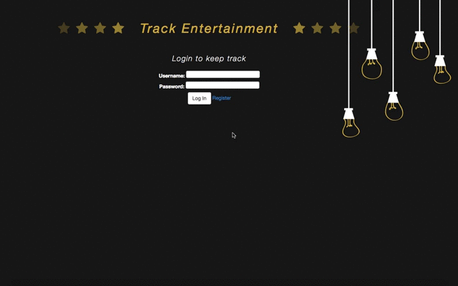
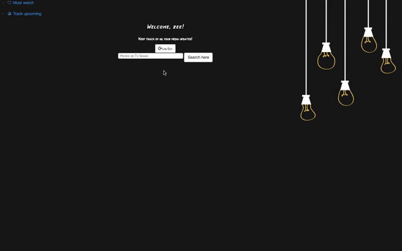

# Track Entertainment

Application Overview:
-----------------------
I developed a full stack web application for users who are always on the go but also have a knack for watching new t.v series or movies. This application utilizes the movie database API to find multiple search results such as movies, t.v shows, and people .The users are able to search upcoming and current media to keep track of the release date as well as update their lists continuously in one sitting.

TrackEntertainment overview:
-------

Must Watch/Upcoming tracker:
-------

Tabs overview:
-------

Why I created this application:
-------------------------
As a movie and t.v show enthusiast, I have realized that Netflix, Hulu, YouTube, etc. just doesn’t cut it when providing a list of entertainment selections to watch. Usually I keep track of all of my new media interests in my notes app on my IPhone or write it down on a piece of paper. By the end of the week I find myself scrolling through Netflix again looking for something to watch. It has been a waste of time to keep up with all of my information since I am constantly on the go. I created this app so that users are able to go directly to their list and without wasting any time select their current t.v show/movie from their lists, and click watch without wasting time scrolling through a recommended directory.

Technologies:
------------------
- HTML5
- CSS3
- JavaScript
- Bootstrap
- MongoDB
- AngularJS
- Express.js
- Node.js
- The Movie Database API
- Heroku

Stretch Goals
---------------
- Social Network Sharing Application
- Mobile App compatibility
